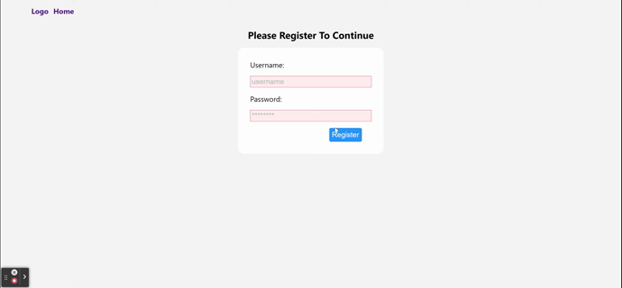

# assessment #4 - MERN-QL

- You must complete the assessment by the beginning of class Tuesday
  September 21th @ 10:00am est. Handed in via github classroom: https://classroom.github.com/a/mMU5hM62
  Once finished, please book your code review with me via the following link: https://calendly.com/patrick-morgan-bkny/c165-assessment-4-gql
  AND email or DM me that you have finished and merged your final branch

## Section One: Climate Action 101

Focus => User Oriented, User Friendly, Developer Friendly, Stability, Completion

### Purpose:

Create a full-stack application with user authentication created with Node, React, Express, GraphQL & Apollo, Mongoose & Mongodb, Jest & Mocha & Chai & Enzyme.
that allows users to post and upvote or downvote climate issues.

This is a fully functional front-end and back-end application including a persistent database and user authentication.
It will push you to create a fully responsive user-driven application.

### Getting Started:

#### Step-1: Plan It

##### Landing Page

##### List of Issues Page

##### Create Issue Page

##### List of Issues By User Page

### Demo App:

##### Login/Sign-up/Get-Issues

##### Create-Post

